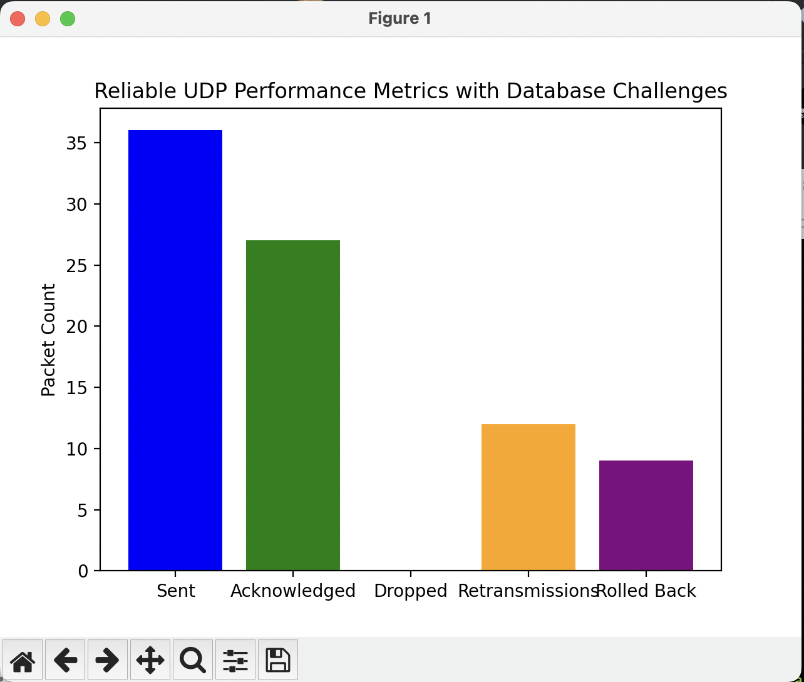

# **Reliable UDP Protocol Meets Database Magic**

## ✨ **Project Overview**

This project blends **networking** with **database engineering** to create a system that handles database write challenges in unreliable network conditions. By integrating a **reliable UDP protocol** and **database resilience techniques**, we ensure data reaches its destination reliably, even in the face of packet loss, slow writes, and deadlocks.

### **Mission:**

-   Simulate **slow writes**, **deadlocks**, and **transaction rollbacks** in the database.
-   Ensure **data integrity** despite **unreliable networks**.
-   Track and visualize **database metrics** (like write time, rollbacks, and deadlocks).

---

## 🧑‍💻 **Database Engineering Magic**

### **1. Simulating Database Failures:**

-   **Slow Writes & Rollbacks**: Introducing delays and failure in database transactions.
-   **Deadlocks**: Simulating traffic jams in database operations that block transactions.

### **2. Reliable UDP Data Transmission:**

-   **Packet Loss Simulation**: Sending data using UDP with occasional packet loss.
-   **Resilient Retransmissions**: Ensuring packets are resent until they are acknowledged.

### **3. Key Database Metrics:**

-   **Write Latency**: Tracking how long it takes to write data to the database.
-   **Rollback & Deadlock Counts**: Counting transaction failures to help improve resilience.

---

## 🚀 **Getting Started**

### **1. Set Up Your Environment:**

-   First, create a virtual environment to manage dependencies:
    ```bash
    python -m venv venv
    source venv/bin/activate  # On Windows use `venv\Scripts\activate`
    ```
-   Install necessary libraries, including `matplotlib` for visualizing data:
    ```bash
    pip install matplotlib
    ```

### **2. Clone or Download the Project:**

-   Download or clone the project repository.

### **3. Running the Project:**

-   Open your terminal and run the following command to start the server:
    ```bash
    python reliable_udp_with_db.py
    ```
    This will simulate the server handling incoming UDP packets and database transactions.

### **4. Visualize the Results:**

-   After running the project, you will see key metrics like:
    -   **Sent and acknowledged packets**
    -   **Database write times**
    -   **Rollback and deadlock counts**
-   These results are visualized using **matplotlib** to track performance.

---

## 🔧 **Key Database Engineering Lessons:**

1. **Handling Database Failures**: Learn how to deal with slow writes, rollbacks, and deadlocks in a simulated environment.
2. **Managing Latency**: Understand how latency affects database operations and how to manage it.
3. **Reliable Data Transmission**: Ensure data integrity even with packet loss using UDP.

---

## 🌟 **Conclusion**

This project demonstrates how **networking** and **database engineering** come together to tackle real-world challenges like slow writes, transaction rollbacks, and deadlocks. It emphasizes creating **fault-tolerant database systems** and ensuring **reliable data transmission** even when the network is unreliable.

---

## 🔮 **Simulated Output Example**

Here’s an example of what you might see when running the system:




## 📚 **Resources**

[Link to Presentation]()

[Link to video](output.svg)

[Link to code]()
